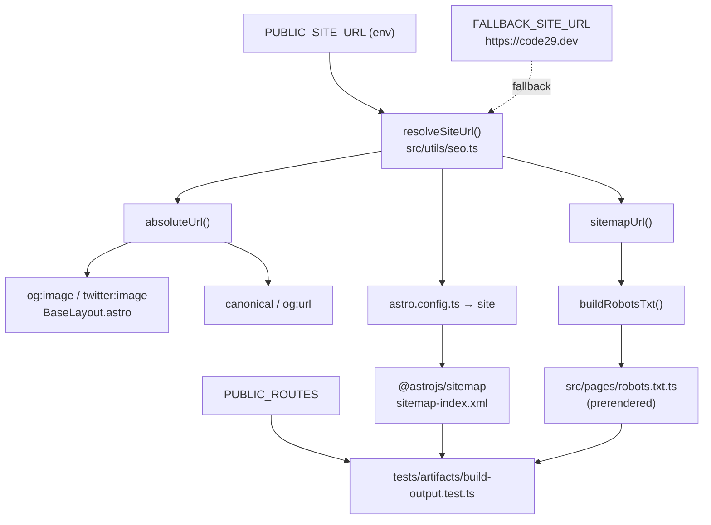

> **Type:** Architecture — **Scope:** SEO & discoverability — **Status:** Active
> **Part of:** [[Architecture]]

# SEO and Discoverability

## Overview

Everything a crawler or a social scraper needs — the canonical URL, the `og:image`,
`robots.txt` and the sitemap — is derived from **one** value: the site origin, resolved
by `src/utils/seo.ts`. No page, layout, integration or static file repeats it.

The rule this enforces: **changing the domain must be a one-line change.** Before it, the
origin was duplicated across `BaseLayout.astro`, `astro.config.ts` and a hand-written
`public/robots.txt`, so a domain change left at least one of them advertising a dead URL.

## Diagram



## Components

| Component | Responsibility |
|-----------|----------------|
| `src/utils/seo.ts` | Single source of truth. Exports `resolveSiteUrl`, `absoluteUrl`, `sitemapUrl`, `buildRobotsTxt`, `PUBLIC_ROUTES`. |
| `src/pages/robots.txt.ts` | Prerendered route that returns `buildRobotsTxt()` as `text/plain`. Replaces the deleted static `public/robots.txt`. |
| `astro.config.ts` | Sets `site` from `resolveSiteUrl(process.env)` and configures the sitemap `filter`. |
| `src/layouts/BaseLayout.astro` | Renders `canonical`, `og:*` and `twitter:*` using `absoluteUrl()`. |
| `@astrojs/sitemap` | Emits `sitemap-index.xml` + `sitemap-0.xml` into the build output. |
| `tests/artifacts/` | Asserts the emitted files, not the source — see [[testing-strategy]]. |

## Decisions & Rationale

### The origin comes from an env var, with a hard-coded fallback

`PUBLIC_SITE_URL` is **optional**. When unset, `resolveSiteUrl()` returns
`https://code29.dev`, so a clean checkout builds correct absolute URLs with no
configuration. Preview deploys and staging set the var to override it.

Two deliberate behaviours:

- Trailing slashes are stripped, so `https://code29.dev/` and `https://code29.dev`
  produce identical output.
- A **scheme-less value throws**. `code29.dev` would silently produce relative
  `og:image` and sitemap URLs, which scrapers and crawlers reject — a defect no test on
  the source could see because it only appears in the rendered HTML. Failing the build
  is the cheaper outcome.

`astro.config.ts` reads `process.env` rather than `import.meta.env`: Astro has not
populated `import.meta.env` at config-evaluation time.

### robots.txt is derived, not static

The previous `public/robots.txt` hard-coded both the origin and the sitemap filename.
`@astrojs/sitemap` emits `sitemap-index.xml`, so the moment either changed, `robots.txt`
pointed crawlers at a 404 — and nothing failed. The route is `prerender = true`, so
production still serves a plain static file; only its authorship moved.

### @astrojs/sitemap is held at 3.2.1

3.7.x targets the Astro 5 integration hooks. On this project's Astro 4.16 it breaks the
build with:

```
Cannot read properties of undefined (reading 'reduce')
```

The working version is **3.2.1**, held by `package-lock.json`. Note the range in
`package.json` is `^3.2.1`, which still *permits* 3.7.x — a fresh install that ignores
the lockfile (or a `npm update`) will reintroduce the failure. Do not bump the sitemap
integration before Astro 5.

### Status pages are excluded from the index

`/404`, `/maintenance` and `/coming-soon` are filtered out of the sitemap in
`astro.config.ts`. They are error states or placeholders; indexing them puts pages that
carry no value into competition with the real landing page. `PUBLIC_ROUTES` in
`seo.ts` names the four routes that *do* belong — `/`, `/legal-notice`,
`/privacy-policy`, `/cookies` — and the artifact tests assert the emitted sitemap
contains exactly those.

### Brand assets are committed, not generated at build time

`public/og-image.png`, `favicon.svg`, `favicon-32.png` and `apple-touch-icon.png` are
produced by `node scripts/generate-brand-assets.mjs` (inline SVG rasterized with
`sharp`, colors mirroring `src/styles/tokens.css`) and **committed on purpose**: the
deploy must not depend on a rasterizer being available in the build image.

Gotchas for whoever regenerates them:

- `sharp` is not a declared `devDependency` — the script resolves it from the transitive
  copy Astro's image tooling installs. It works today; add it explicitly if the script
  ever needs to run in a clean environment.
- Type uses a generic sans stack, not the display font. `sharp` rasterizes with system
  fonts; Space Grotesk is loaded by the browser, not installed here.

## Invariants & Gotchas

- Never hard-code the origin anywhere. Import from `src/utils/seo.ts`.
- `og:image` must be absolute. Social scrapers ignore root-relative image paths.
- `npm run verify:assets` requires a preceding `npm run build`: it asserts over
  `.vercel/output/static`, which is where the Vercel adapter writes static output — not
  `dist/`.

## References

- [[testing-strategy]]
- [[i18n]]
- [[tech-stack-decision]]
- [[decisions/0004-backend-deploy-provider]]
